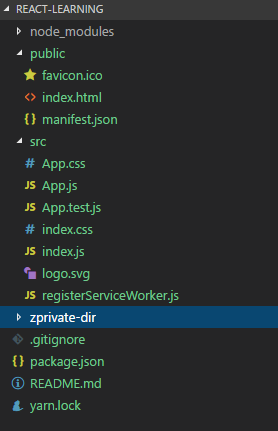

## 1.使用create-react-app自动化构建项目
```
$ cnpm install -g create-react-app
$ create-react-app react-learning
$ cd react-learning/
$ npm start

```
create-react-app是基于webpack+es6的react项目自动化构建工具，假设您已经安装好node npm cnpm等环境：  

1. 全局安装create-react-app构建工具
2. 使用create-react-app工具初始化一个react项目，名字是react-learning
3. 进入项目目录react-learning
4. 使用npm start启动目录

可以看到，构建的目录结构如下：  



1. node_modules 是项目的依赖，里面引入了react相关库和babel等
2. public 放置公共资源文件，如favicon和html模板等
3. src 是主要的代码文件，我们写的代码主要放在这里，默认生成app和index等文件
4. .gitignore 配置提交到远程时要忽略的文件
5. package.json 声明模块安装的依赖信息
6. zprivate-dir 是本人的私人目录，忽略


主要来讲解一下src这个目录下的文件。
再来回顾一下《react学习笔记集合》的第一篇文章中提到的没有使用构建工具来写的一个基础react项目：
```html
<head>
    <meta charset="UTF-8" />
    <title>Hello React!</title>
    <script src="https://cdn.bootcss.com/react/15.4.2/react.min.js"></script>
    <script src="https://cdn.bootcss.com/react/15.4.2/react-dom.min.js"></script>
    <script src="https://cdn.bootcss.com/babel-standalone/6.22.1/babel.min.js"></script>
</head>

<body>
    <div id="root"></div>
    <script type="text/babel">
        var Hello=React.createClass({
            render:function(){
                return <h1>Hello, world!</h1>
            }
        });
      ReactDOM.render(<Hello/>,document.getElementById('root'));
    </script>
</body>

</html>
```
### 1-index.html
在我们使用create-react-app来自动构建react项目的目录结构中，public/ 下的index.html文件就是我们react的外皮，也可以说是模板，里边放置了一个id为root的d容器。使用
```
$ npm run build
```
将项目打包出来，我们可以看到index.html中的代码如下：
```html
<!DOCTYPE html><html lang="en"><head><meta charset="utf-8"><meta name="viewport" content="width=device-width,initial-scale=1,shrink-to-fit=no"><meta name="theme-color" content="#000000"><link rel="manifest" href="/manifest.json"><link rel="shortcut icon" href="/favicon.ico"><title>React App</title><link href="/static/css/main.c17080f1.css" rel="stylesheet"></head><body><noscript>You need to enable JavaScript to run this app.</noscript><div id="root"></div><script type="text/javascript" src="/static/js/main.ca62a29f.js"></script></body></html>
```
可以看到webpack将生成的css、js都打入的这个模板文件中。

### 2-index.js 
index.js文件中的代码如下：
```js
import React from 'react';
import ReactDOM from 'react-dom';
import './index.css';
import App from './App';
import registerServiceWorker from './registerServiceWorker';

ReactDOM.render(<App />, document.getElementById('root'));
registerServiceWorker();

```
在可以看到在这个文件中使用了common.js语法将react和react-dom引入，并引入样式文件index.css,引入组件APP.js，然后将App这个组件插入到id为root的节点中。
这个文件的工作类似于没有使用构建工具的：
```js
 ReactDOM.render(<Hello/>,document.getElementById('root'));
```
### 3-App.js
```js
import React, { Component } from 'react';
import logo from './logo.svg';
import './App.css';

class App extends Component {
  render() {
    return (
      <div className="App">
        <header className="App-header">
          
          <h1 className="App-title">Welcome to React</h1>
        </header>
        <p className="App-intro">
          To get started, edit <code>src/App.js</code> and save to reload.
        </p>
      </div>
    );
  }
}

export default App;

```
App.js中使用class App extends Component声明一个组件，然后使用使用
export default App;导出。
这个文件的工作类似于没有使用构建工具的：
```js
 var Hello=React.createClass({
    render:function(){
        return <h1>Hello, world!</h1>
    }
});
```
> 演示：  

> 代码地址：


> 文章参照  <a href="http://www.runoob.com/react/" target="_blank"> [ 菜鸟教程-react ]</a>  

> 文章参照<a href="http://www.ruanyifeng.com/blog/2015/03/react.html" target="_blank"> [ 阮一峰老师-react ]</a>
